# Adventures in Odyssey — Secured PIN

How the secured PIN works, how to set it up in Zapp, and how to check that it
works. Written for product, QA and the backend team.

The detailed backend contract — every field, event and status code — lives in
[`../contract/aioc-pin-feeds-spec.md`](../contract/aioc-pin-feeds-spec.md).
This page is the plain-language companion to it.

---

## 1. In one minute

- **Any profile can have its own 4-digit PIN.** A protected profile asks for its
  PIN before it opens. Cancelling leaves you on the profile list.
- **Each profile manages its own PIN** from its settings: set it, change it,
  turn it off, or request a reset email if it was forgotten.
- **The account owner can give another profile a PIN** from that profile's
  edit form, after proving the owner's own: the owner types the new code, so
  the child is told a code rather than emailed one.
- **Mature content is behind the owner's PIN.** On any profile other than the
  account owner's, an episode marked *Mature* asks for the owner's PIN before it
  opens. The owner opens it directly. While the owner has no PIN at all, the
  episode is locked and says so.
- **Choosing a profile opens Home.**
- **Feeds follow the active profile.** Everything on screen is loaded for the
  profile in session.

## 2. Who is who

Every account has exactly one **account owner** — the profile marked `master` in
the profile list. Only the owner holds parental authority. A profile that is not
a kids profile is still not a parent: *adult* and *owner* are different things.

Which PIN the app asks for:

| What you are doing | PIN asked for |
|---|---|
| Opening a protected profile | that profile's own PIN |
| Changing or turning off your own PIN | your own current PIN |
| Setting another profile's PIN | the **owner's** PIN, then the new code |
| Opening a *Mature* episode on a non-owner profile | the **owner's** PIN |
| Requesting a reset email ("Forgot PIN") | none — the email goes to the account |

Two rules that explain most "why didn't it ask me?" questions:

1. **A profile without a PIN opens freely.** There is no code to ask for.
2. **While the owner has no PIN, *Mature* content is locked, not open.** There
   is no code to ask for either, so the episode explains that the account owner
   has to set a PIN first. The owner is the only one who sees it open.
3. **The owner is never asked for their PIN to see *Mature* content.**

## 3. Where it lives in the app

| Area | Behaviour |
|---|---|
| Profile list | a profile with a PIN asks for it before it opens — except the one you are already in |
| After choosing a profile | Home opens (`goHome`, cell type `action`) |
| Active profile | its name and avatar are stored with its id and shown in the top bar |
| **Profile selection → PIN Actions** | Set / Change / Disable / Forgot PIN, and the owner's own control, depending on the profile's state. Below the **Manage Profiles** button, where you asked for it on 22 Sep |
| **Profile selection → Manage Profiles → edit form** | a **Set PIN** / **Change PIN** button, owner's PIN required first |
| *Mature* episodes | ask for the owner's PIN on non-owner profiles; locked while the owner has no PIN |
| Switching profile | feeds are loaded for the new profile |

## 4. Setup

### Where the feeds come from today

Until your backend serves these feeds itself, a reference server at
`https://zapp-ran-demo.web.app` does. It **proxies your own CMS** and adds only
the PIN parts on the way through, so names, avatars and episodes are always
yours.

The urls below are that stand's. Each one becomes yours, at an address of your
choosing — the app is told every feed's url in Zapp, so nothing depends on how
they are spelled here.

| Feed | URL | Used by |
|---|---|---|
| Profile list | `https://zapp-ran-demo.web.app/viewer-profiles` | **Profiles – Select** |
| A profile's PIN settings | `https://zapp-ran-demo.web.app/pin/actions` | **Profiles – Select**, below the manage button |
| Owner actions on another profile | `https://zapp-ran-demo.web.app/pin/actions/manage?profile=<id>` | Manage Profiles |
| Forgot PIN | `https://zapp-ran-demo.web.app/pin/recover` | Forgot PIN screen |
| Profile edit form | `https://zapp-ran-demo.web.app/profiles/form?profile={{profile}}` | **Profile Form Screen** — the locator is filled from the entry that opened the screen, so the form is about the profile that was tapped; without that the form edits whoever is holding the phone |
| Groupings with the *Mature* gate | `https://zapp-ran-demo.web.app/groupings/<same path as CMS/groupings>` | grouping screens |
| PIN events | `https://zapp-ran-demo.web.app/cloud-events` | the PIN screen and every PIN action |
| The manage button and its gate | `https://zapp-ran-demo.web.app/profiles/manage-entry` | **nothing yet** — the button is still a static feed, so the PIN gate in front of Manage Profiles is served but not reached |
| The list in manage mode | `https://zapp-ran-demo.web.app/viewer-profiles?mode=manage` | **nothing yet** — the manage screen has no feed configured |

The last two answer already and can be read with curl; they are wired up on the
day the manage journey is built (spec §4.4 and §3, Addition 5).

### Zapp checklist

**1. PIN screen** (`parent-lock-qb`, named *PIN*)

- *Enable Remote PIN Verification*: **on**
- *PIN Verification Endpoint*: `https://zapp-ran-demo.web.app/cloud-events`
- PIN length: **4**
- *Forgot PIN Button Text* (localisations): the label for the way out of the
  screen. It shows only where the feed supplies actions for it, which both
  gates do; its font, size, colour and margin are in the style group **Forgot
  PIN Button**.

> [!NOTE]
> What the screen asks for is per request, not per app: the feed sends
> `promptText`, so a prompt can name the profile — "Enter the PIN for Jamie" —
> instead of one sentence for everything. The configured instructions stay as
> the fallback.

**2. Content type mappings**

| Content type | Screen | Why |
|---|---|---|
| `parent-lock` | PIN | every PIN prompt opens this screen |
| `profile-edit` | Profile Form Screen | the profile's fields |
| `audio-detail` | Generic Detail (Level 5) | where a *Mature* episode opens after the PIN |

**3. Profile list refresh**

On the **Profiles – Select** screen, turn on **Clear cache on reload** for the
profile list component. The list says which profiles have a PIN; without this
setting the app keeps showing the list it loaded first, so a PIN set a minute
ago is not asked for until the app restarts.

**4. Endpoints** (Pipes endpoints, context keys)

The hosts below are our demo server; substitute your own. What matters is the
path and the context keys on it.

| URL | Context keys |
|---|---|
| `…/` (the profile list) | bearer, `user_account.profile` → header `profile` |
| `…/cloud-events` | `quick-brick-login-flow.access_token` → bearer |
| `…/pin/actions` | bearer, `user_account.profile` → header `profile` |
| `…/profiles/form` | bearer; tag `allow_missing_keys`. The subject comes from the screen's own data source, not from a context key — see step 7 |
| `…/groupings` | bearer, `user_account.profile` → header **`X-VIEWER-ID`** |

> [!IMPORTANT]
> Every request that is *about* a viewer has to name that viewer, and only the
> endpoint configuration can do it — nothing in the url carries it.
>
> - Without it on `…/groupings`, the server cannot tell who is watching,
>   treats the viewer as a non-owner, and asks the **owner** for their PIN as
>   well. This endpoint is required, not optional.
> - Without it on the **profile list**, the server cannot tell which profile
>   the person is already in, so re-selecting the profile they are in asks for
>   its PIN again.
>
> Either name works — the server reads `profile` and `X-VIEWER-ID` alike.
>
> Right after an app restart the header arrives empty, because the active
> profile is kept in session scope and nobody has chosen one yet. That is
> expected: the list is then served as it is to everyone.

**5. Padlock on restricted cells**

No app work is needed: the cell styles already know how to draw one. In Zapp,
for **each cell style used by the grouping screens** (the album list, the rows
on Listen, search results), open the style's **Assets** section and set:

| Setting | Value |
|---|---|
| **Lock badge** (`lock_badge_switch`) | on |
| **Lock badge data key** (`lock_badge_data_key`) | `extensions.unlocked` |
| **Locked badge** (`locked_badge`) | upload your padlock image (PNG, transparent, 144 px or larger) |
| **Unlocked badge** (`unlocked_badge`) | leave empty, unless you also want to mark open content — see below |
| **Lock badge width / height** | 24–40 pt |
| **Lock badge position** (`lock_badge_position`) | `center`, `top_right`, `bottom_left`, `bottom_right` — see below |
| **Lock badge margins** | to taste |

The badge is drawn **over the cell's artwork**, so the position is relative to
the image: `center` reads most clearly as "you cannot open this", while a corner
is tidier. Avoid `top_left`, the default, where the artwork already carries the
album number.

Then publish the layout and run `prepare` on the app.

How the app reads it: a **truthy** value at that path means unlocked, a falsy
one means locked, and a **missing** key means no badge at all. The default in
the style is `extensions.free`, which these feeds do not carry — change it, or
no badge appears. The feed sends `extensions.unlocked: false` on a restricted
entry and nothing on an ordinary one, so only restricted cells get a padlock.

If the padlock appears on **every** cell, the data key is still the default; if
it appears **nowhere**, either the switch is off or no locked image was
uploaded.

**Marking open content too.** Setting an **Unlocked badge** alone changes
nothing: the feed says nothing about entries the viewer may open, and a missing
key draws no badge. To use that image, turn on `markUnlockedEntries` in the
`@lib/mock-podcast` config — every entry the viewer may open then carries
`extensions.unlocked: true`, mature content included when the owner is
watching. Leave it off to keep the padlock on restricted cells only.

A cell that needs the owner's PIN and a cell that is locked because the owner
has no PIN look the same — the style has one image for both. Tapping them is
what differs: a PIN screen versus an explanation.

**6. Point the manage button at your own endpoint**

Open this component in Zapp:

```
https://zapp.applicaster.com/accounts/69c2e983e7f828288d1e4777/app_families/6420/rivers_configurations/1896fce8-2197-4867-adf5-c7e74c5b8108/rivers?component=56a7a98c-75bf-460d-80fd-e8450dbb6699
```

It is **Profiles - Manage Button** (`56a7a98c-75bf-460d-80fd-e8450dbb6699`) on the
*Profiles – Select (Standalone)* screen. Its **Data source** today is a static
JSON file:

```
https://assets-production.applicaster.com/zapp/assets/accounts/69c2e983e7f828288d1e4777/static_feeds/feed-d9588fab-0667-4c87-b6e0-df4707d16c23.json
```

**Replace that url with your own endpoint**, serving the manage entry described
in [§4.4 of the contract](../contract/aioc-pin-feeds-spec.md#44-the-manage-button).
Put it wherever it belongs in your API — the app is told the url here, so the
path is yours to choose. Until it exists, the reference server answers the same
shape at:

```
https://zapp-ran-demo.web.app/profiles/manage-entry
```

**Why the file has to go.** The button's **label** and its **chain** both follow
the profile in session — `Manage Profiles` for the owner, `Manage Profile` for a
child, and the PIN gate in front of it only when that profile has a code. A
static file says one thing to everybody, so none of this requirement works while
the button reads one.

**Then register the new url** under **Pipes endpoints**, the way
`…/pin/actions` already is: `user_account.profile` as a required `ctx` key.
Without it the request goes out naming nobody, and the entry cannot know whose
button it is. Nothing else to map — the content type `profiles-manage` already
points at the manage screen.

**7. The profile form's subject**

The form has to be about the profile whose tile was tapped, not about whoever is
holding the phone. It learns that from its own data source: the url carries a
locator, and a mapping fills it from the entry that opened the screen.

```json
{
  "form_feed": {
    "source": "https://…/profiles/form?profile={{profile}}",
    "mapping": {
      "profile": { "property": "extensions.form_data.profileId", "source": "entry" }
    }
  }
}
```

`source: "entry"` is the tile that was tapped, and `property` is where on it the
id sits — so the tile carries
`"extensions": { "form_data": { "profileId": "…" } }`.

> [!WARNING]
> **The locator does nothing on its own.** `?profile={{profile}}` without the
> mapping leaves the braces in the url and the screen comes up blank: the form
> loader builds its request with an empty screen context, so there is nothing
> for a bare locator to resolve against.

There is a working example of this configuration on the sandbox form screen.

**8. What the form cannot hold**

Two things the requirements put on this screen do not belong in a form, and no
configuration changes that:

- **The PIN controls.** The set of buttons a profile gets changes the instant a
  code is set — *Set* before, *Change* and *Delete* after — and a form cannot
  fetch itself again to show the new set. A feed component can, and the PIN
  actions already do. They need a surface of their own: a tab, or a block above
  the fields.
- **Anything text-only,** such as the "Account Owner" header or an explanatory
  line. A property whose preset is not in the app's presets mapping is dropped
  before it reaches the screen, and no label preset is mapped. A component that
  shows a title, a subtitle and a comment is being added for this.

Both point the same way — a profile page around the form, either as a tabbed
screen or as a page the tile opens with a way through to the form. A worked
example: [local-podcast-example
#3](https://github.com/applicaster/local-podcast-example/pull/3).

## 5. How to test

Prepare an account with at least two profiles: the owner and one other profile.
Start with **no PINs set** — this is how a fresh account looks.

Screens are from the iOS app. In the scenarios below the owner is
**Keith VanderVeen** and the second profile is **Abigail**.

### 5.1 Choose a profile without a PIN

1. Launch the app. The profile list opens.
2. Tap the owner.

**Expected:** Home opens straight away.

<p>
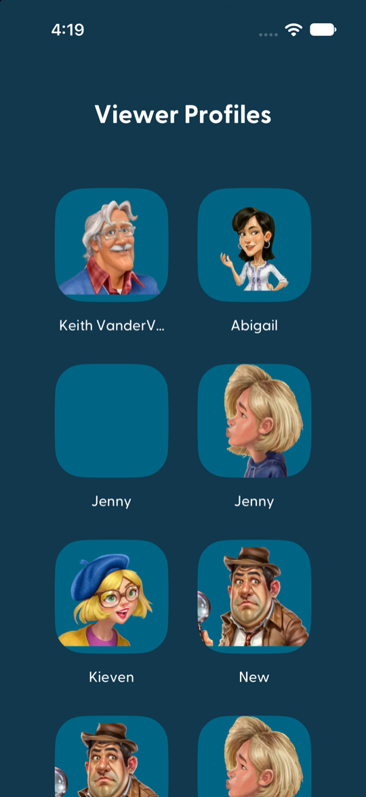
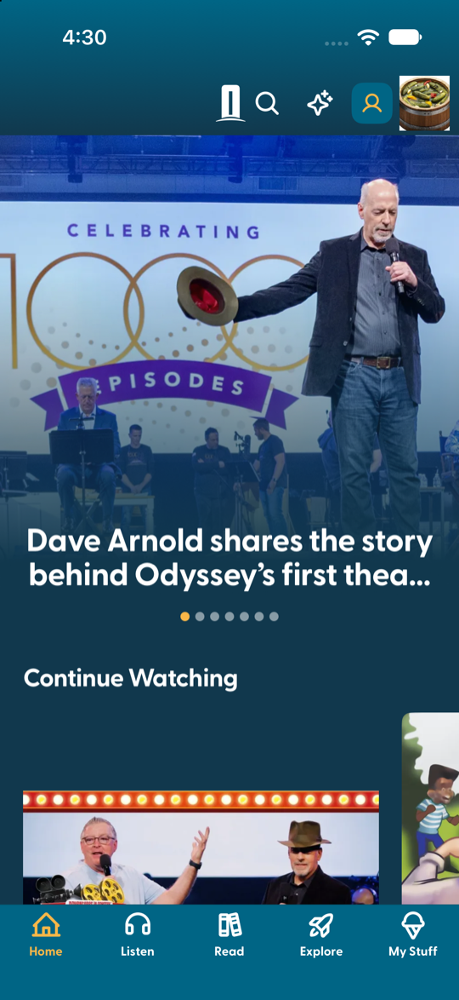
</p>

### 5.2 Set a PIN

1. On the profile selection screen, scroll past the tiles to **PIN Actions** →
   **Set PIN**.
2. Enter a 4-digit code, then enter it again.

**Expected:** "PIN was successfully set" is shown briefly and the screen
closes. **PIN Actions** now offers **Change PIN**, **Disable PIN**, the
owner's control
and **Forgot PIN** instead of **Set PIN**.

<p>
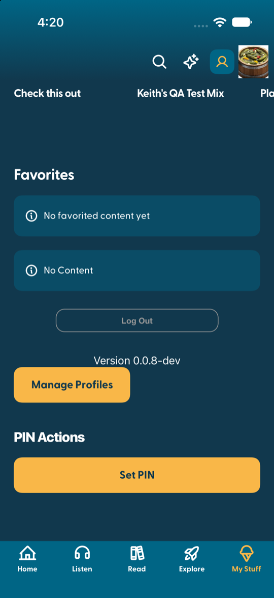
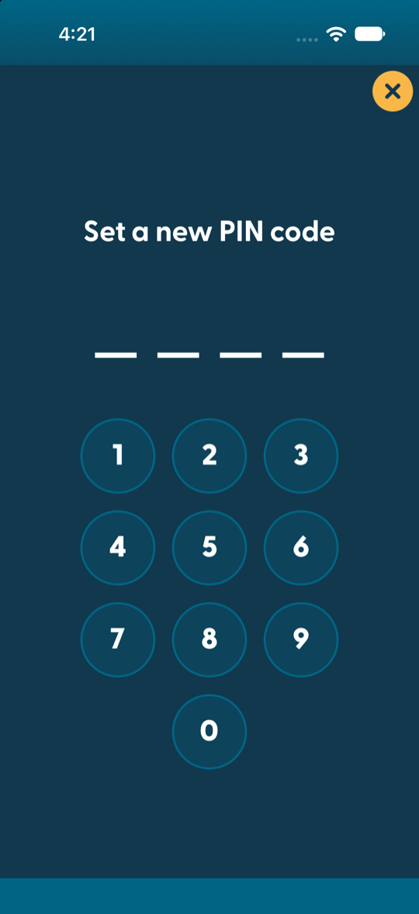
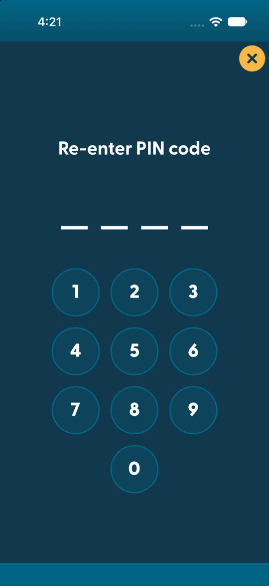
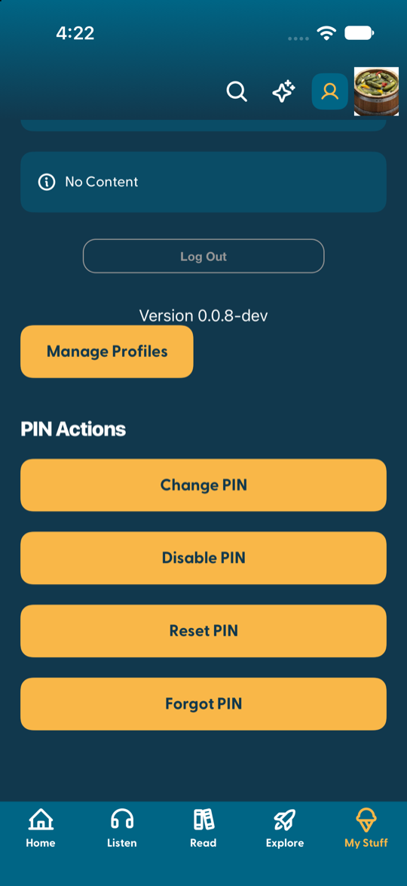
</p>

The buttons belong to the profile in session: on Abigail's profile the same
section still shows only **Set PIN**.

### 5.3 Open a protected profile

1. Tap the yellow profile icon in the top bar to return to the profile list.
2. Tap the owner (who now has a PIN).

**Expected:**

| You do | Result |
|---|---|
| enter a wrong code | "Invalid pin code"; you stay on the PIN screen |
| tap **✕** | back on the profile list; the profile is **not** entered |
| tap **Forgot your PIN?** | the screen closes unverified and a reminder is requested for that profile |
| enter the right code | Home opens |

The prompt names the profile it is asking about, and re-opening the profile you
are already in asks for nothing at all.

<p>
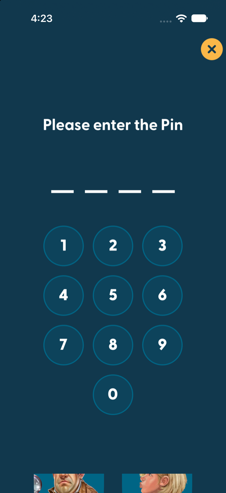
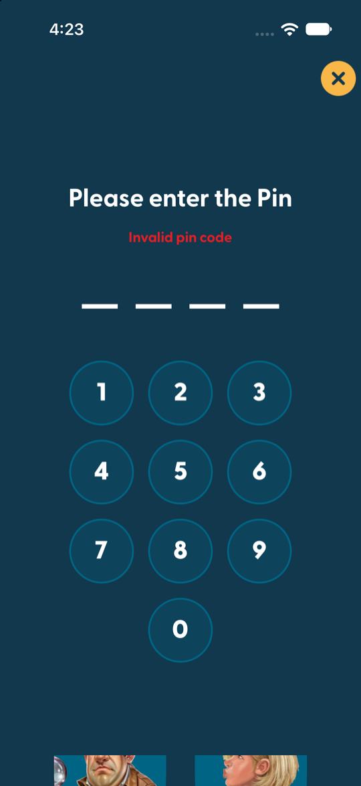
</p>

### 5.4 *Mature* content on a non-owner profile

Needs: the owner has a PIN (5.2).

1. Switch to **Abigail**.
2. **Listen** → **Albums in Order** → **#01: The Adventure Begins**.
3. Scroll to **A Member of the Family, Part 1 of 2** (episode 017) and tap it.
   Part 2 (018) is *Mature* as well.

**Expected:**

| You do | Result |
|---|---|
| tap the episode | the PIN screen opens — it asks for the **owner's** PIN |
| tap **✕** | you stay on the album; the episode does not open |
| enter the owner's PIN | the episode opens |

Other episodes of the album open without a PIN.

**With no owner PIN**, the same episode is **locked** instead: tapping it opens
a short explanation that the account owner must set a PIN, and nothing else —
the episode does not open, and its own buttons (add to queue, add to playlist)
are not offered. Test it by removing the owner's PIN and reopening the album.

> [!NOTE]
> The wording of that explanation is a placeholder on the reference server
> (`lockedTitle`, `lockedMessage`, `lockedOkButton` in the module config) until
> your own copy arrives.

<p>
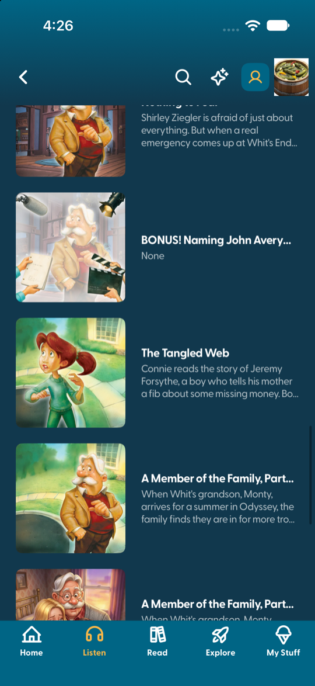
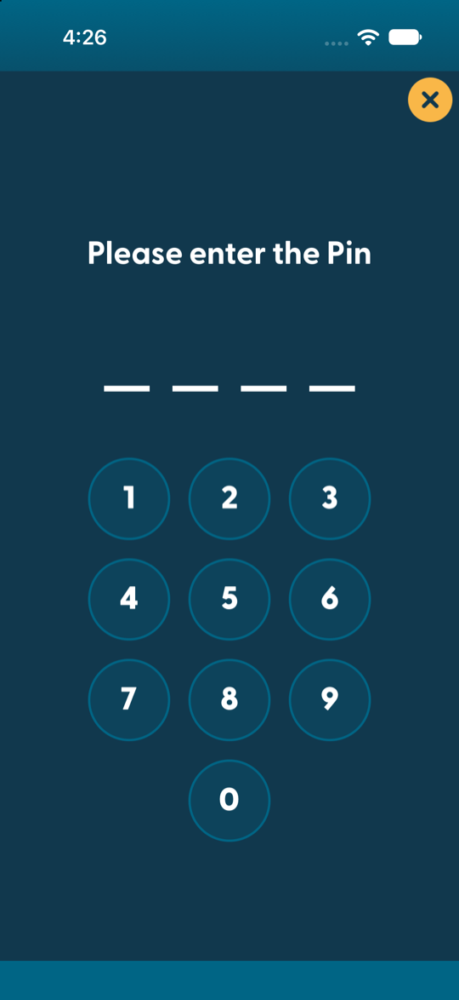
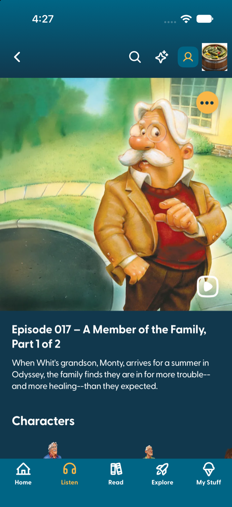
</p>

### 5.5 *Mature* content on the owner's profile

1. Switch to the owner (enter the owner's PIN).
2. Open the same episode.

**Expected:** the episode opens directly — no PIN.

### 5.6 The owner gives another profile a PIN

1. On **Abigail**: profile selection → **Manage Profiles** → tap Abigail's avatar.
2. The edit form has a PIN button: **Set PIN** while the profile has no PIN,
   **Change PIN** once it has one. Tap it.

   > This button is a stopgap. The PIN belongs on a surface that can refresh
   > itself, not in the form — step 8 of the checklist. It is here because it is
   > the only way to reach another profile's PIN until that surface exists.
3. Enter the **owner's** PIN — that is what authorises the change.
4. Type the new code for Abigail, twice.

**Expected:** the code is Abigail's from that moment. Nothing is emailed: the
owner is standing there choosing it.

<p>
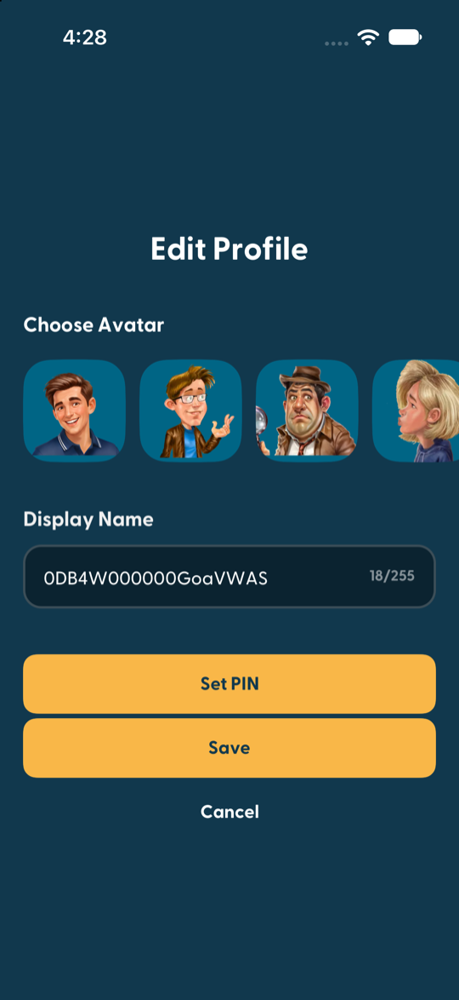
</p>

> [!NOTE]
> The screenshot predates the rename and shows the button as **Reset PIN**; it
> now reads **Set PIN** or **Change PIN**, and the screens that follow it name
> the profile — "Enter the account owner's PIN (…)", then "Set a new PIN for
> …". It will be retaken once the form is served through the reference server
> in this app; until then the shape is right and only the wording is old.
>
> A parent handing out a code and a person recovering a forgotten one are
> different acts, and only the second involves email; see 5.7.

### 5.7 Change, turn off, forget

On a profile that has a PIN, profile selection → **PIN Actions**:

| Button | What happens |
|---|---|
| **Change PIN** | asks for the current PIN, then the new one twice |
| **Disable PIN** | asks for confirmation, then for the current PIN; the profile opens freely afterwards |
| **Set PIN (account owner)** / **Change PIN (account owner)** | the same act as 5.6, offered here until the app has a Manage Profiles screen for it. The label says whose code it asks for, because the profile's own **Change PIN** sits right above it |
| **Forgot PIN** | no code asked; "An email to set a new PIN was sent to the account." |

<p>
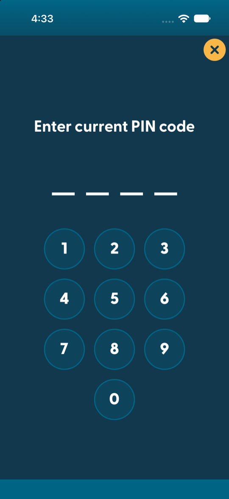
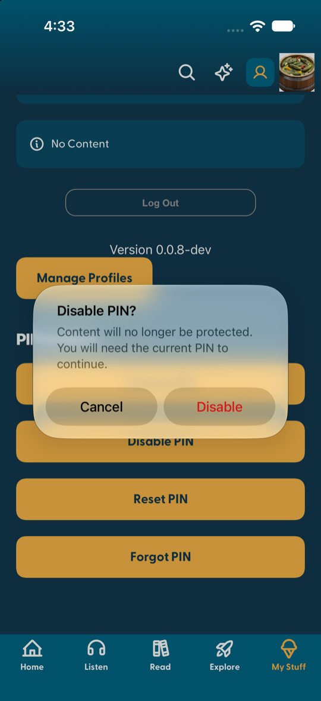
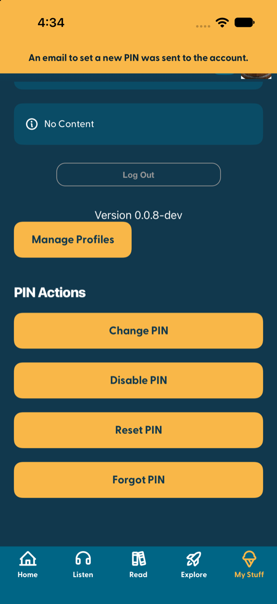
</p>

### 5.8 Start over

To return the test account to "no PINs", with the reference server running
locally:

```bash
tools/reset-pins.sh
```

## 6. For your backend

Everything the reference server adds is meant to move into your CMS, after
which the app talks to you directly and the reference server is switched off.
The full contract is in [the spec](../contract/aioc-pin-feeds-spec.md);
three points of it are described here:

**Profile tap actions end with `goHome`.** In `CMS/profiles/select`, the last
action of each profile's `tap_actions` is:

```json
{ "type": "goHome" }
```

The profile list is not always opened as a hook, so the chain navigates to Home
itself.

**Gate *Mature* entries in `CMS/groupings/*`.** For every entry — nested ones
included — whose `extensions.sensitive_content` is `"Mature"`, when the viewer
(`X-VIEWER-ID`) is **not** the account owner **and** the owner has a PIN,
return the entry as:

```json
{
  "id": "g2227e852",
  "title": "A Member of the Family, Part 1 of 2",
  "type": { "value": "action" },
  "media_group": [ "…unchanged…" ],
  "extensions": {
    "sensitive_content": "Mature",
    "…": "…every other field unchanged…",
    "tap_actions": {
      "actions": [
        { "type": "pinCode",
          "options": { "typeMapping": "parent-lock", "flow": "verify-pin",
                       "cloudEventPayload": { "profile": "<OWNER profile id>" } } },
        { "type": "navigateToScreen",
          "options": { "typeMapping": "audio-detail", "navigationAction": "push",
                       "entry": { "…": "the original entry, unchanged" } } }
      ]
    }
  }
}
```

Three details decide whether it works:

- **`type` becomes `action`, and the entry's own `link` is removed.** The app
  opens a regular cell *after* running its actions whatever their outcome, so a
  cancelled PIN in front of a regular cell would still open the episode. An
  `action` cell only runs its actions; the original entry — link included —
  travels inside `navigateToScreen`.
- **`extensions.entry_action` goes as well.** The "…" menu runs its actions
  straight from the cell, without the chain, so a gated episode that keeps its
  menu can still be queued — and downloaded, on a build with downloads — with
  no PIN asked for. The copy inside `navigateToScreen` keeps the menu: by then
  the code has been entered.
- **Leave everything alone for the owner.**
- **With no owner PIN, lock the entry instead of gating it.** There is no code
  to ask for, so a gate would be a dead end: a keypad nobody present can
  satisfy. Return the entry as `type: action`, with the `link` and its own tap
  actions removed, `extensions.locked: true`, and a single one-button notice
  saying the account owner must set a PIN:

```json
{ "type": "showAlert",
  "options": { "title": "Locked",
               "message": "This is restricted for this profile. Ask the account owner to set up a PIN to unlock it.",
               "okButtonText": "OK" } }
```

`showAlert` is the one dialog with a single button — `confirmDialog` always
draws two, the second blank when no cancel label is given.
- **Treat a request without `X-VIEWER-ID` as a non-owner.** Not knowing who is
  watching is not the same as knowing it is the owner.
- **Mark restricted entries with `extensions.unlocked: false`,** and leave the
  key off everything else. That is what draws the padlock on the cell (§4,
  step 5): truthy means unlocked, falsy means locked, missing means no badge.
- **The *Unlock* / *Locked* button label is not covered by any of this.** BR-P1
  asks the play button to rename itself, and that button is on the episode
  screen, fed by `CMS/audio-video/<id>` — a feed nothing here touches. The gate
  is on the list entry instead, so a restricted episode reached by deep link,
  search or Continue Watching opens ungated and keeps its usual button. One
  decision covers both halves: drop the labels along with the list-level gate,
  or extend the gate to the episode feed so it can carry them.

`sensitive_content` values other than `"Mature"` (including `""`) are not gated.

**`CMS/profiles/form` answers about the profile in the url.** It takes
`?profile=<id>` and returns that profile's form — which is what lets a parent's
screen differ from a child's, since nothing else in the request names the
subject. How the value gets there is Zapp configuration, step 7 above.

What it returns is yours to decide, field by field: which fields a viewer sees,
the Parental Controls section built from `denied_actions`, the date of birth,
the owner's note. [Section 6 of the
spec](../contract/aioc-pin-feeds-spec.md#6-profile-form--what-it-has-to-become)
has each of them, including where the screen takes its starting values from —
`extensions.form_data` on your profile entry, not the form.

Two of those the form cannot show, whatever it returns: the PIN controls and
anything text-only. Step 8 says why, and what goes in their place.

### Content restrictions by topic

The gate above protects one thing from everybody: an episode marked *Mature* is
closed to every profile that is not the owner's. What the requirements describe
is narrower — each child is kept away from **the topics its parent chose**, and
two children on the same account can have different lists.

Three additions make that work, and they stand on their own — nothing else has
to land first.

**1. A vocabulary.** A fixed list of topics a parent can exclude, each with a
stable id and a display title. It is returned inside the form's
`contentRestrictions` property, so it needs no endpoint of its own — the shape
is in [§6, Addition 4 of the
spec](../contract/aioc-pin-feeds-spec.md#addition-4--the-parental-controls-section).
Pick the ids once: content is tagged with them, so renaming one silently unlocks
everything tagged with the old name.

**2. The chosen topics, per profile.** In `CMS/profiles/select` and in the form
response:

```json
"extensions": { "content_restrictions": ["violence", "occult"] }
```

Absent or `[]` means nothing is restricted for that profile. The form's Save
writes it.

**3. The topics each item carries.** On every entry in `CMS/groupings/*` — and
anywhere else the app reaches content:

```json
"extensions": { "topics": ["violence"] }
```

Free text does not work here. `devotional_theme` and `long_theme` are prose
written for people to read; they cannot be compared to a parent's choices
without guessing. These are the same ids as the vocabulary, nothing else.

**The rule.** An item is restricted for a profile when the two lists share at
least one id. No overlap, no gate. Then everything above applies unchanged: the
entry becomes `action`, the owner's PIN is what opens it, and with no owner PIN
it is locked with the notice instead.

**During the change-over,** keep returning `sensitive_content` as it is today.
The gate reads both — an entry is restricted if its topics overlap the profile's
list **or** it is marked `"Mature"` and the viewer is not the owner — so the two
can run side by side and the flag can be dropped once every item carries topics.
Nothing breaks on the day the first topic appears.

**Which content types need topics:** every one a profile can play. Gating
episodes while a video of the same story opens freely is not a restriction, it
is a detour.

### The rest is in the contract

Two more feeds belong to the Manage Profiles journey — the button that carries
the PIN gate, and the profile list answering in manage mode. Both are described
in [spec §4.4](../contract/aioc-pin-feeds-spec.md#44-the-manage-button)
and [§3, Addition 5](../contract/aioc-pin-feeds-spec.md#addition-5--the-same-list-again-in-manage-mode),
and both answer on the reference server today, so they can be read before they
are built.

## 7. Good to know

- **A wrong PIN does not open anything, but the check that matters is on the
  server.** A failed step ends the chain, so nothing behind
  it runs; before that it carried on. Either way, whatever the server is asked
  to do *after* a PIN — turn one off, set one on another profile — has to be
  checked by the server again: the chain runs on the device, and the device is
  not the thing being protected. The spec, §7, describes how.
- **Changing another profile's PIN is accepted only right after the owner's.**
  A verified owner PIN opens a five-minute window on the server, and a set that
  replaces an existing code outside that window is refused.
- **Kids profiles cannot set or change a PIN.** That is a rule of the PIN
  screen itself.
- **The recovery email is not sent by the reference server** — it only records
  the request. Sending it, and deciding whether it carries the code or a way to
  choose a new one, is your backend's part.

## 8. Troubleshooting

| You see | Likely cause |
|---|---|
| A protected profile opens without asking | *Clear cache on reload* is off on the profile list (§4, step 3), so the list shown predates the PIN — restart the app to confirm |
| The owner is asked for a PIN on a *Mature* episode | the `…/groupings` endpoint lacks `user_account.profile` → `X-VIEWER-ID` (§4, step 4) |
| A non-owner opens a *Mature* episode freely | the build predates feeds reloading on a profile change, so the list on screen was loaded for the owner — with no owner PIN the episode is locked, not open (§2) |
| A *Mature* episode only shows an explanation | the account owner has no PIN yet (§2); set one and the episode asks for it instead |
| "Invalid pin code" on a correct code | the code was checked against a different profile — for *Mature* content, and for the owner acting on another profile, it is the **owner's** PIN |
| Choosing a profile shows Home twice | the profile entries must be `type: action` and end with `goHome` (§6) |
| Every PIN request fails with 401 | the user is not logged in; all PIN feeds and events need the account's bearer token |
